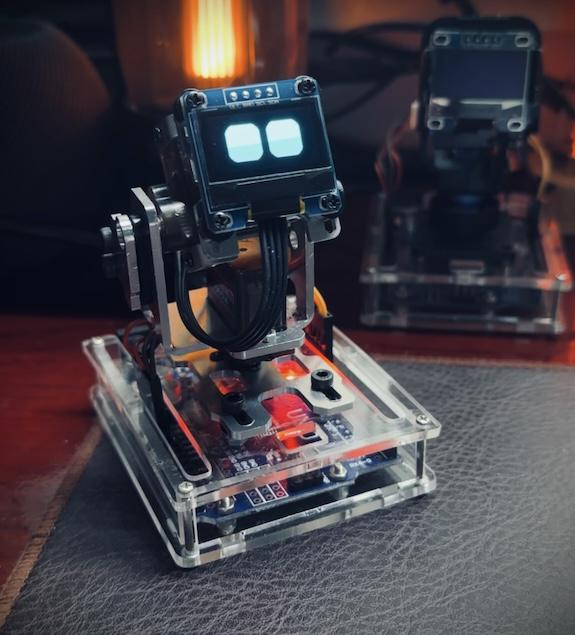
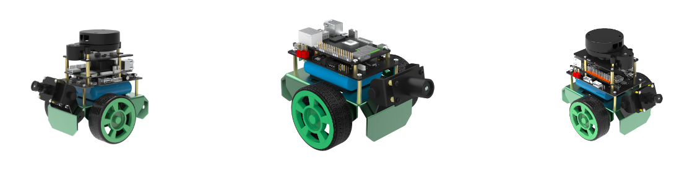
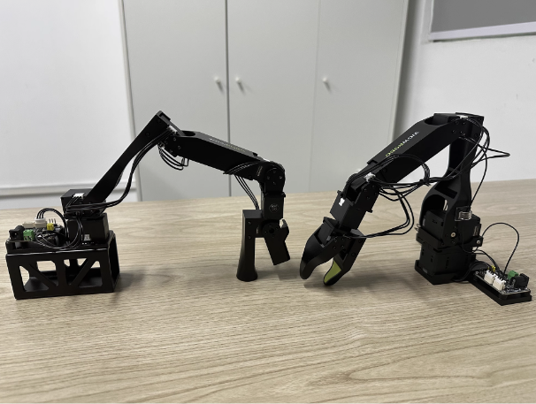
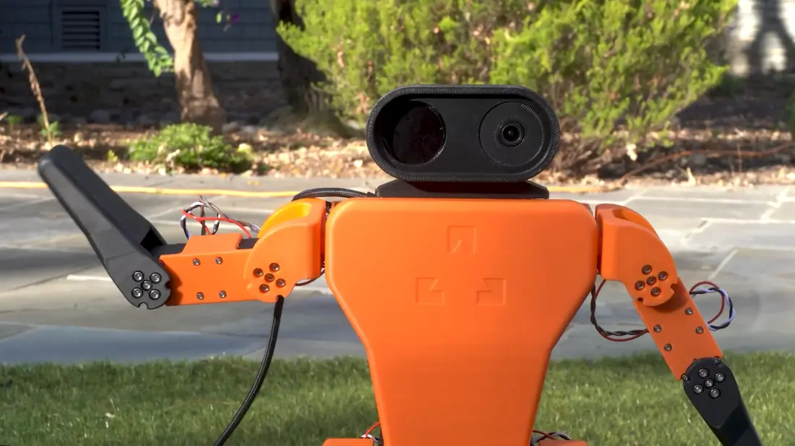
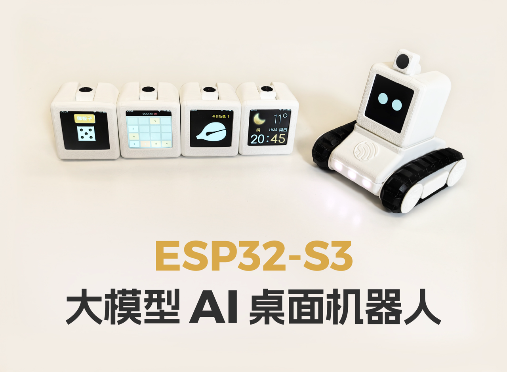

> 欢迎你加入我们的大家庭！这里将会简单介绍公司情况，并列明你需要做的一些事情，帮助你更快地融入公司与团队。

# We Hands Robot

# **愿景目标**

给大家带来手搓创造的乐趣，

# 简介

知识库收集各种手搓机器人教程

# 开始

## OTTO机器人

https://mubu.com/doc/3Hvshg0sOOg

提取码:ultirobot

## Desk-emoji  一篇给新手的【从0手搓机器人】教程

https://mp.weixin.qq.com/s/8HUfKoPuK5eP8C-ILnmm1Q

## OriginBot

https://www.originbot.org/

## LeRobot

https://www.bilibili.com/video/BV1LhxPebENU/?buvid=Y44BB049A9F2FE8E4C7ABF928CB46DC80F76\&from\_spmid=main.space-contribution.0.0\&is\_story\_h5=false\&mid=VV4t61jjBJa%2FEDIOdWRQUw%3D%3D\&plat\_id=114\&share\_from=ugc\&share\_medium=iphone\&share\_plat=ios\&share\_session\_id=A1BF3129-34D7-47F3-8565-373C5239B203\&share\_source=WEIXIN\&share\_tag=s\_i\&timestamp=1731192272\&unique\_k=FVYN2Q9\&up\_id=3546759758350430

## Zeroth Bot

https://docs.zeroth.bot/

## ESP-Friends

https://www.bilibili.com/video/BV1MezzYaEfP/?spm\_id\_from=333.788.top\_right\_bar\_window\_custom\_collection.content.click\&vd\_source=d2333d387085807d02952906bb6783dc

硬件开源地址：https://oshwhub.com/esp-college/esp-sparkbot

软件开源地址：https://gitee.com/esp-friends/esp\_sparkbot

## BD-X

https://github.com/apirrone/Open\_Duck\_Mini

## 海豹麦轮车

[ 实战项目-海豹麦轮车](https://x509p6c8to.feishu.cn/wiki/V0lPw1cwQiXg39kPmldciDOKn2f)

# 具身智能模型

# 学习资源

## 具身智能基础技术路线

https://www.bilibili.com/video/BV1d5ukedEsi/?spm\_id\_from=333.1007.top\_right\_bar\_window\_custom\_collection.content.click\&vd\_source=d2333d387085807d02952906bb6783dc

# 兴趣小组

## 交流

zognlincai

# 友情链接

##

